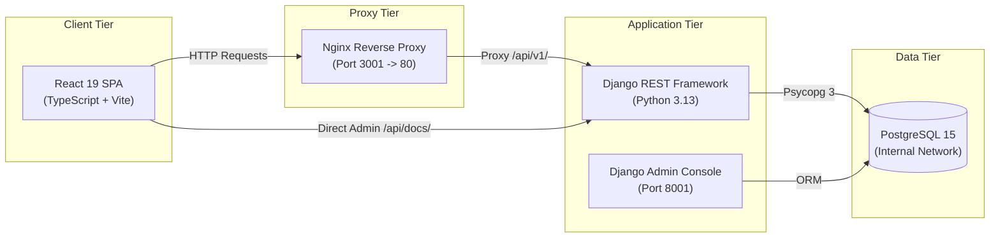
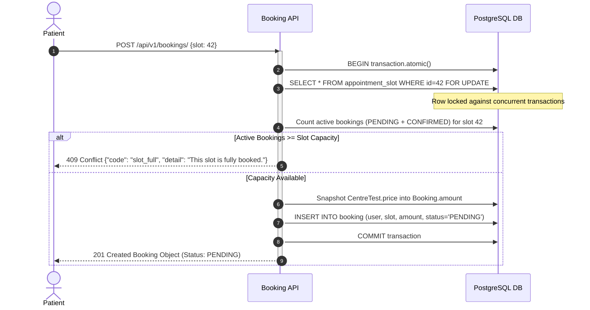
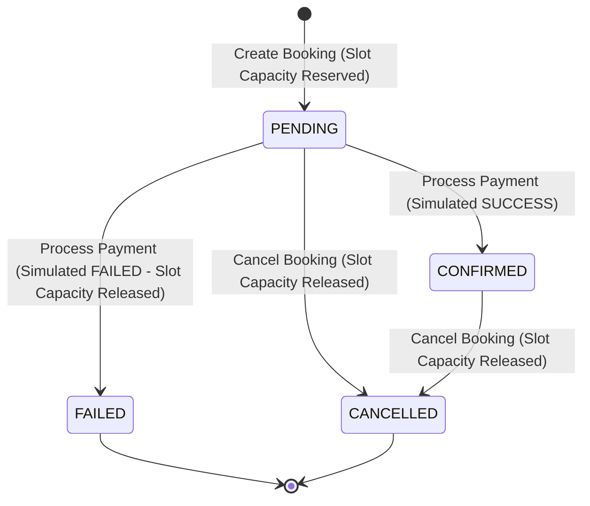

# EVE Healthcare — Diagnostic Test Booking Platform

EVE Healthcare is a full-stack, multi-tenant diagnostic test booking platform built with Django REST Framework (Python) and a React Single Page Application (TypeScript, Vite, Tailwind CSS), containerized with Docker. It provides a complete patient booking pipeline—including centre discovery, test catalog exploration with centre-specific pricing, calendar-based capacity-managed appointment scheduling, simulated payment processing, and idempotent webhook handling—alongside a dedicated Centre Admin dashboard for multi-tenant clinic operations and bulk slot generation.

---

## Table of Contents
- [1. Assignment Overview](#1-assignment-overview)
- [2. Quick Start — Docker (Reviewer Recommended)](#2-quick-start--docker-reviewer-recommended)
- [3. Demo Accounts](#3-demo-accounts)
- [4. Reviewer Demo Workflow](#4-reviewer-demo-workflow)
- [5. Key Features](#5-key-features)
- [6. Architecture](#6-architecture)
- [7. Technology Stack](#7-technology-stack)
- [8. Database Design & ER Diagram](#8-database-design--er-diagram)
- [9. Booking & Capacity Flow](#9-booking--capacity-flow)
- [10. Booking Status Lifecycle](#10-booking-status-lifecycle)
- [11. Simulated Payment Flow](#11-simulated-payment-flow)
- [12. Webhook Idempotency](#12-webhook-idempotency)
- [13. Centre Admin Multi-Tenant Authorization](#13-centre-admin-multi-tenant-authorization)
- [14. Bulk Slot Generation](#14-bulk-slot-generation)
- [15. API Reference](#15-api-reference)
- [16. API Request & Response Examples](#16-api-request--response-examples)
- [17. Error Handling & Edge Cases](#17-error-handling--edge-cases)
- [18. Demo Data Dataset](#18-demo-data-dataset)
- [19. Local Development Without Docker](#19-local-development-without-docker)
- [20. Testing & Verification](#20-testing--verification)
- [21. Project Structure](#21-project-structure)
- [22. Security & Production Considerations](#22-security--production-considerations)
- [23. Assumptions & Design Decisions](#23-assumptions--design-decisions)
- [24. Future Improvements](#24-future-improvements)
- [25. Deployment](#25-deployment)
- [26. Assignment Evaluation Mapping](#26-assignment-evaluation-mapping)

---

## 1. Assignment Overview

EVE Healthcare addresses the challenge of diagnostic appointment overbooking, dynamic centre-specific test pricing, and multi-tenant clinic management.

### Patient Capabilities
- **Discover Diagnostic Centres**: Search and browse active healthcare facilities with address and location details.
- **Explore Test Catalog**: View global pathology and imaging diagnostic services with centre-specific fees.
- **Check Real-Time Slot Availability**: Filter available dates and inspect open 30-minute appointment slots with remaining capacity.
- **Create Bookings**: Reserve appointment slots with concurrency-safe overbooking protection.
- **Simulate Payment Processing**: Test simulated payment outcomes (`SUCCESS` or `FAILED`).
- **Manage Appointments**: Track booking status (`PENDING`, `CONFIRMED`, `FAILED`, `CANCELLED`) and cancel eligible reservations.

### Centre Admin Capabilities
- **Multi-Tenant Operations**: Access assigned diagnostic centres via `CentreMembership`.
- **Manage Offerings & Prices**: Set custom fees and availability per test per centre.
- **Single & Bulk Slot Generation**: Create individual time slots or bulk-generate multi-day recurring schedules with overlap detection.
- **Monitor Bookings**: Inspect real-time dashboard analytics and patient appointment rosters.

### Platform Admin Capabilities
- **Global Governance**: Manage global users, centres, tests, memberships, and transaction logs via Django Admin.

> **Note on Payment Processing**: Per assignment requirements, payment processing is **SIMULATED** via internal API endpoints. No external payment gateway (e.g. Razorpay or Stripe) is connected.

---

## 2. Quick Start — Docker (Reviewer Recommended)

The repository includes a automated Docker Compose setup with health checks, automatic database migrations, and idempotent demo data seeding.

### Step 1: Clone Repository
```bash
git clone https://github.com/aaryan417/EVE-Healthcare-diagnostic-booking
cd EVE-Healthcare-diagnostic-booking
```

### Step 2: Copy Environment File

**Windows PowerShell:**
```powershell
Copy-Item .env.example .env
```

**Windows CMD:**
```cmd
copy .env.example .env
```

**Linux / macOS:**
```bash
cp .env.example .env
```

### Step 3: Launch Docker Containers
```bash
docker compose up --build
```
> **Automatic Bootstrapping**: On container startup, PostgreSQL executes health checks, Django database migrations run automatically, and demo data initializes when `SEED_DEMO_DATA=true`. No manual `createsuperuser` or `seed_demo` commands are required.

### Verified Local Service Endpoints
- **Frontend SPA**: [http://localhost:3001](http://localhost:3001)
- **Backend API**: [http://localhost:8001](http://localhost:8001)
- **Interactive Swagger Docs**: [http://localhost:8001/api/docs/](http://localhost:8001/api/docs/)
- **API Health Check**: [http://localhost:8001/api/health/](http://localhost:8001/api/health/)
- **Django Admin Console**: [http://localhost:8001/admin/](http://localhost:8001/admin/)

---

## 3. Demo Accounts

The following reviewer credentials are pre-configured through `.env.example`:

| Role | Login URL | Email | Password | Assigned Scope |
| :--- | :--- | :--- | :--- | :--- |
| **Patient** | [http://localhost:3001/login](http://localhost:3001/login) | `patient@example.com` | `PatientPass123!` | Public Patient Access |
| **Centre Admin A** | [http://localhost:3001/centre-admin/login](http://localhost:3001/centre-admin/login) | `centreadmin_a@clinic.com` | `AdminPass123!` | Apollo Diagnostics — Indiranagar |
| **Centre Admin B** | [http://localhost:3001/centre-admin/login](http://localhost:3001/centre-admin/login) | `centreadmin_b@clinic.com` | `AdminPass123!` | Metropolis Healthcare — Koramangala |
| **Platform Admin** | [http://localhost:8001/admin/](http://localhost:8001/admin/) | `admin@evehealthcare.com` | `AdminPass123!` | Global Django Superuser |

> [!WARNING]
> These credentials exist solely for local assignment evaluation. In production environments, demo seeding must be disabled by setting `SEED_DEMO_DATA=false`.

---

## 4. Reviewer Demo Workflow

### 1. Patient Workflow
1. Navigate to [http://localhost:3001/login](http://localhost:3001/login) and log in as `patient@example.com`.
2. Browse **Diagnostic Centres** (e.g. *Suburban Diagnostics — Bandra West*).
3. Click **View Available Tests** to browse offering prices (e.g. *MRI Brain* at ₹4,800.00).
4. Click **Book Test**, choose a date, and select an open time slot.
5. Click **Confirm & Proceed to Payment** to create a `PENDING` booking.
6. On the simulated payment screen, click **Simulate Successful Payment** (`CONFIRMED`) or **Simulate Failed Payment** (`FAILED`).
7. Check **My Appointments** to view booking status or cancel active reservations.

### 2. Centre Admin Workflow
1. Navigate to [http://localhost:3001/centre-admin/login](http://localhost:3001/centre-admin/login) and log in as `centreadmin_a@clinic.com`.
2. Review the **Dashboard** metrics (Active Tests, Total Bookings, Upcoming Slots).
3. Go to **Tests & Pricing** to adjust test availability or fees.
4. Go to **Appointment Slots**:
   - Use **Bulk Generate Slots** to generate multi-day schedules (e.g. 30-min slots from 09:00 to 17:00).
   - Create custom individual exception slots.
5. Go to **Bookings** to review patient reservations for the assigned centre.

### 3. Platform Admin Workflow
1. Log in at [http://localhost:8001/admin/](http://localhost:8001/admin/) with `admin@evehealthcare.com`.
2. Inspect registered entities: `Users`, `DiagnosticCentres`, `DiagnosticTests`, `CentreTests`, `CentreMemberships`, `AppointmentSlots`, `Bookings`, `Payments`, and `WebhookEvents`.

---

## 5. Key Features

- **JWT Authentication & Profiles**: Custom User model using email as unique identifier, pairing SimpleJWT access/refresh tokens with user context restoration (`/api/v1/auth/me/`).
- **Multi-Tenant Authorization**: Role-based access (`CentreMembership`) scoping clinic managers strictly to assigned centres.
- **Flexible Test Catalog & Dynamic Pricing**: Global diagnostic test repository with per-centre pricing and availability overrides (`CentreTest`).
- **Calendar & Capacity-Aware Slots**: Dynamic availability filtering enforcing working hours and slot-level capacity limits.
- **Atomic Booking Engine**: Pessimistic locking (`select_for_update()`) within atomic DB transactions (`transaction.atomic()`) preventing overbooking under high concurrency.
- **Bulk Slot Generation**: Automated schedule generator creating non-overlapping time slots across date ranges up to 31 days with duplicate skipping.
- **Simulated Payment Lifecycle**: Two-phase payment processing (`PENDING` $\rightarrow$ `SUCCESS` / `FAILED`) with automatic slot capacity release on failure or cancellation.
- **Idempotent Webhook Processing**: Race-condition-safe payment gateway webhook handler with DB-level `UNIQUE(event_id)` constraint and nested transaction savepoints.
- **OpenAPI & Hardening**: Interactive Swagger UI, health monitoring (`/api/health/`), structured API error payloads, and DRF rate throttling.

---

## 6. Architecture



### Docker Network Structure
- **`frontend` container**: Runs Nginx serving compiled static assets and reverse-proxying `/api/` traffic to `backend:8000`.
- **`backend` container**: Runs Django REST Framework on port 8000 (exposed to host as 8001).
- **`db` container**: Runs PostgreSQL 15 on port 5432, accessible only within the internal Docker network (`eve_healthcare_db`).

---

## 7. Technology Stack

| Layer | Technology | Version | Purpose |
| :--- | :--- | :--- | :--- |
| **Backend Language** | Python | `3.13.3` | Core runtime |
| **Backend Framework** | Django | `5.1.4` | Web framework & ORM |
| **API Framework** | Django REST Framework | `3.15.2` | RESTful API layer |
| **Authentication** | djangorestframework-simplejwt | `5.3.1` | JWT access & refresh tokens |
| **CORS Middleware** | django-cors-headers | `4.6.0` | Cross-origin request configuration |
| **Database Adapter** | psycopg (binary) | `3.2.3` | PostgreSQL database driver |
| **Database** | PostgreSQL | `15-alpine` | Relational database |
| **API Documentation** | drf-spectacular | `0.28.0` | OpenAPI 3.0 schema & Swagger UI |
| **Testing** | pytest / pytest-django | `8.3.4` / `4.9.0` | Test runner & Django integration (**207 passed**) |
| **Frontend Framework**| React | `19.2.8` | UI library |
| **Frontend Language** | TypeScript | `6.0.2` | Static typing |
| **Build Tool** | Vite | `8.3.0` | Development server & production builder |
| **Styling** | Tailwind CSS | `4.3.3` | Utility-first CSS framework |
| **Icons & Utilities** | Lucide React / Axios | `1.49.0` / `1.20.0` | Icons & HTTP client |
| **Containerization** | Docker & Docker Compose | N/A | Container orchestration |

---

## 8. Database Design & ER Diagram

```mermaid
erDiagram
    User ||--o{ CentreMembership : "holds"
    User ||--o{ Booking : "places"
    DiagnosticCentre ||--o{ CentreMembership : "has"
    DiagnosticCentre ||--o{ CentreTest : "offers"
    DiagnosticTest ||--o{ CentreTest : "defines"
    CentreTest ||--o{ AppointmentSlot : "schedules"
    CentreTest ||--o{ Booking : "references"
    AppointmentSlot ||--o{ Booking : "reserves"
    Booking ||--o{ Payment : "generates"
    WebhookEvent }|..|--|| Payment : "audits transaction"

    User {
        bigint id PK
        string email UK
        string name
        boolean is_staff
        boolean is_superuser
    }

    DiagnosticCentre {
        bigint id PK
        string name
        string address
        string city
        string state
        string pincode
        boolean is_active
    }

    DiagnosticTest {
        bigint id PK
        string name UK
        string description
        boolean is_active
    }

    CentreTest {
        bigint id PK
        bigint centre_id FK
        bigint test_id FK
        decimal price
        boolean is_available
    }

    CentreMembership {
        bigint id PK
        bigint user_id FK
        bigint centre_id FK
        string role
    }

    AppointmentSlot {
        bigint id PK
        bigint centre_test_id FK
        date date
        time start_time
        time end_time
        integer capacity
    }

    Booking {
        bigint id PK
        bigint user_id FK
        bigint centre_test_id FK
        bigint slot_id FK
        decimal amount
        string status
        datetime cancelled_at
    }

    Payment {
        bigint id PK
        bigint booking_id FK
        string transaction_id UK
        decimal amount
        string status
    }

    WebhookEvent {
        bigint id PK
        string event_id UK
        string event_type
        string transaction_id
        json payload
        datetime processed_at
    }
```

### Model Explanations & Key Constraints

1. **`User`**: Custom user model with `email` as `USERNAME_FIELD`.
2. **`DiagnosticCentre`**: Represents a physical diagnostic facility. Indexed on `(city, is_active)`.
3. **`DiagnosticTest`**: Global test catalog entry. Enforces `unique_lower_diagnostic_test_name` constraint.
4. **`CentreTest`**: Joins a global test to a centre with `price` and `is_available`. Enforces `UNIQUE(centre_id, test_id)`.
5. **`CentreMembership`**: Scopes Centre Admin users to specific diagnostic centres. Enforces `UNIQUE(user_id, centre_id)`.
6. **`AppointmentSlot`**: Calendar date/time slot with `capacity`. Enforces `UNIQUE(centre_test_id, date, start_time, end_time)` and `CheckConstraint(capacity >= 1)`.
7. **`Booking`**: Patient reservation holding a point-in-time `amount` snapshot. Enforces partial unique constraint `UNIQUE(user, slot)` for active (`PENDING`, `CONFIRMED`) bookings.
8. **`Payment`**: Financial transaction attempt linked to a booking. Enforces `UNIQUE(transaction_id)`.
9. **`WebhookEvent`**: Stores gateway webhook payloads. Enforces `UNIQUE(event_id)` for idempotency.

---

## 9. Booking & Capacity Flow



### Concurrency Protection Mechanism
Overbooking prevention is guaranteed at the database level using `transaction.atomic()` combined with `select_for_update()` on the `AppointmentSlot` model. Concurrent booking attempts for the same slot block until the active transaction completes, ensuring capacity checks evaluate against committed state.

---

## 10. Booking Status Lifecycle



---

## 11. Simulated Payment Flow

Per assignment instructions, payment processing is simulated via `/api/v1/payments/`.

### Processing Rules
1. Initiated via `POST /api/v1/payments/` with payload `{"booking": <id>, "simulate_result": "SUCCESS" | "FAILED"}`.
2. Uses `transaction.atomic()` and `select_for_update()` on the target `Booking`.
3. Validates that the initiating user owns the booking and that current status is `PENDING`.
4. Snapshots `amount` directly from `booking.amount`.
5. Generates a unique `transaction_id` (`PAY_<UUID>`).
6. Atomically updates statuses:
   - `SUCCESS`: `Payment.status = SUCCESS`, `Booking.status = CONFIRMED`.
   - `FAILED`: `Payment.status = FAILED`, `Booking.status = FAILED` (releasing slot capacity for other patients).

---

## 12. Webhook Idempotency

Webhooks are handled via `POST /api/v1/payments/webhook/`.

### Idempotency Strategy
1. **Primary Check**: Queries `WebhookEvent` by `event_id`. If found, immediately returns `{"status": "already_processed", "already_processed": true}`.
2. **Race Condition Safety**: Uses a nested `with transaction.atomic():` savepoint to execute `WebhookEvent.objects.create(event_id=event_id, ...)`. If a parallel transaction commits the same `event_id` simultaneously, PostgreSQL raises an `IntegrityError`, caught by the handler to safely return the idempotent response.
3. **State Machine Safety**:
   - `CANCELLED` bookings reject payment webhooks.
   - `SUCCESS` payments cannot transition to `FAILED`.
   - `FAILED` payments cannot transition to `SUCCESS`.

---

## 13. Centre Admin Multi-Tenant Authorization

Multi-tenancy is enforced using the `CentreMembership` model (`Role.ADMIN`).

- **Permission Check**: `user_can_manage_centre(user, centre)` verifies whether the user is a Platform Admin (`is_superuser=True`) or holds an active `CentreMembership` for that centre.
- **Queryset Isolation**: Centre Admins query only offerings, slots, and bookings belonging to their assigned centres via `get_centres_visible_to_user()` and `get_slots_visible_to_user()`.
- **Decoupled Roles**: Standard Django `is_staff` privileges do NOT grant centre administration permissions.

---

## 14. Bulk Slot Generation

Centre Admins can generate recurring multi-day appointment slots via `POST /api/v1/centre-admin/slots/bulk-generate/`.

### Limits & Safeguards
- **Max Date Range**: Up to 31 consecutive days per request.
- **Max Generated Slots**: Cap of 1,000 slots per request.
- **Working Hours Calculation**: Splits `start_time` to `end_time` into intervals matching `slot_duration_minutes`.
- **Overlap Prevention**: Evaluates existing slots in bulk (`date__range=(start_date, end_date)`) and skips overlapping candidate slots without throwing errors.
- **Performance**: Performs creation inside `transaction.atomic()` using `AppointmentSlot.objects.bulk_create()`.

---

## 15. API Reference

| Category | Method | Endpoint | Auth | Description |
| :--- | :--- | :--- | :--- | :--- |
| **System** | `GET` | `/api/health/` | Public | System & DB health check |
| **System** | `GET` | `/api/docs/` | Public | Interactive Swagger UI |
| **Auth** | `POST` | `/api/v1/auth/register/` | Public | Register new patient account |
| **Auth** | `POST` | `/api/v1/auth/login/` | Public | Obtain JWT token pair (`access`, `refresh`) |
| **Auth** | `POST` | `/api/v1/auth/token/refresh/` | Public | Refresh JWT access token |
| **Auth** | `GET` | `/api/v1/auth/me/` | Bearer JWT | Retrieve current user profile |
| **Centre Admin** | `GET` | `/api/v1/centre-admin/me/` | Bearer JWT | Retrieve Centre Admin memberships |
| **Centre Admin** | `GET` | `/api/v1/centre-admin/dashboard/` | Bearer JWT | Fetch dashboard metrics & recent bookings |
| **Centre Admin** | `POST` | `/api/v1/centre-admin/slots/bulk-generate/` | Bearer JWT | Bulk generate multi-day appointment slots |
| **Centres** | `GET` | `/api/v1/centres/` | Public | List diagnostic centres (paginated) |
| **Centres** | `GET` | `/api/v1/centres/{id}/` | Public | Retrieve centre detail |
| **Tests** | `GET` | `/api/v1/tests/` | Public | List global diagnostic tests catalog |
| **Centre Tests**| `GET` | `/api/v1/centre-tests/` | Public | List centre test offerings & prices |
| **Centre Tests**| `GET` | `/api/v1/centre-tests/{id}/` | Public | Retrieve centre test offering detail |
| **Slots** | `GET` | `/api/v1/slots/` | Public | List available slots (filterable by `centre_test`, `date`) |
| **Slots** | `GET` | `/api/v1/slots/available-dates/` | Public | List available calendar dates for centre test |
| **Slots** | `POST` | `/api/v1/slots/` | Bearer JWT | Create single appointment slot |
| **Bookings** | `GET` | `/api/v1/bookings/` | Bearer JWT | List user's bookings (paginated) |
| **Bookings** | `POST` | `/api/v1/bookings/` | Bearer JWT | Create new appointment booking (`PENDING`) |
| **Bookings** | `GET` | `/api/v1/bookings/{id}/` | Bearer JWT | Retrieve booking detail |
| **Bookings** | `POST` | `/api/v1/bookings/{id}/cancel/`| Bearer JWT | Cancel pending/confirmed booking |
| **Payments** | `POST` | `/api/v1/payments/` | Bearer JWT | Process simulated payment |
| **Payments** | `GET` | `/api/v1/payments/{id}/` | Bearer JWT | Retrieve payment transaction detail |
| **Payments** | `POST` | `/api/v1/payments/webhook/` | Public | Idempotent payment webhook handler |

---

## 16. API Request & Response Examples

### 1. Patient Registration
`POST /api/v1/auth/register/`
```json
// Request
{
  "email": "jane.doe@example.com",
  "password": "Password123!",
  "name": "Jane Doe"
}

// Response (201 Created)
{
  "user": {
    "id": 4,
    "email": "jane.doe@example.com",
    "name": "Jane Doe"
  },
  "tokens": {
    "refresh": "eyJhbGciOi...",
    "access": "eyJhbGciOi..."
  }
}
```

### 2. Login
`POST /api/v1/auth/login/`
```json
// Request
{
  "email": "patient@example.com",
  "password": "PatientPass123!"
}

// Response (200 OK)
{
  "access": "eyJhbGciOi...",
  "refresh": "eyJhbGciOi...",
  "user": {
    "id": 3,
    "email": "patient@example.com",
    "name": "Aaryan Verma"
  }
}
```

### 3. List Diagnostic Centres
`GET /api/v1/centres/`
```json
// Response (200 OK)
{
  "count": 3,
  "next": null,
  "previous": null,
  "results": [
    {
      "id": 1,
      "name": "Apollo Diagnostics — Indiranagar",
      "address": "100 Feet Road, 12th Main",
      "city": "Bengaluru",
      "state": "Karnataka",
      "pincode": "560038",
      "is_active": true
    }
  ]
}
```

### 4. Create Booking
`POST /api/v1/bookings/`
```json
// Request
{
  "slot": 15
}

// Response (201 Created)
{
  "id": 8,
  "status": "PENDING",
  "amount": "4800.00",
  "user": {
    "id": 3,
    "name": "Aaryan Verma",
    "email": "patient@example.com"
  },
  "centre": {
    "id": 3,
    "name": "Suburban Diagnostics — Bandra West",
    "address": "Linking Road, Near National Park",
    "city": "Mumbai",
    "state": "Maharashtra",
    "pincode": "400050"
  },
  "test": {
    "id": 8,
    "name": "MRI Brain"
  },
  "slot": {
    "id": 15,
    "date": "2026-10-03",
    "start_time": "09:00:00",
    "end_time": "09:30:00"
  }
}
```

### 5. Simulate Payment
`POST /api/v1/payments/`
```json
// Request
{
  "booking": 8,
  "simulate_result": "SUCCESS"
}

// Response (201 Created)
{
  "id": 4,
  "transaction_id": "PAY_9A8B7C6D5E4F",
  "booking": 8,
  "amount": "4800.00",
  "status": "SUCCESS",
  "booking_status": "CONFIRMED"
}
```

### 6. Payment Webhook
`POST /api/v1/payments/webhook/`
```json
// Request
{
  "event_id": "evt_test_1001",
  "event_type": "payment.updated",
  "data": {
    "transaction_id": "PAY_9A8B7C6D5E4F",
    "status": "SUCCESS"
  }
}

// Response (200 OK)
{
  "status": "success",
  "already_processed": false,
  "event_id": "evt_test_1001",
  "message": "Webhook event processed successfully."
}
```

### 7. Bulk Slot Generation
`POST /api/v1/centre-admin/slots/bulk-generate/`
```json
// Request
{
  "centre_test": 1,
  "start_date": "2026-10-03",
  "end_date": "2026-10-05",
  "start_time": "09:00",
  "end_time": "11:00",
  "slot_duration_minutes": 30,
  "capacity": 5
}

// Response (201 Created)
{
  "message": "Slots generated successfully.",
  "created_count": 12,
  "skipped_count": 0,
  "date_count": 3,
  "centre_test": 1,
  "start_date": "2026-10-03",
  "end_date": "2026-10-05"
}
```

---

## 17. Error Handling & Edge Cases

| Scenario | HTTP Status | Response Payload / Error Code | Handling Logic |
| :--- | :--- | :--- | :--- |
| **Unauthenticated Request** | `401 Unauthorized` | `{"detail": "Authentication credentials were not provided."}` | Rejected by DRF JWT authentication. |
| **Unauthorized Centre Admin Access** | `403 Forbidden` | `{"centre_test": "You do not have permission to manage slots for this centre."}` | Checked via `user_can_manage_centre()`. |
| **Overbooked Slot Reservation** | `409 Conflict` | `{"code": "slot_full", "detail": "This appointment slot is fully booked."}` | Caught by pessimistic row lock (`select_for_update()`). |
| **Duplicate Active User Booking** | `400 Bad Request` | `{"non_field_errors": ["You already have an active booking..."]}` | Rejected by active booking query check. |
| **Past Date Slot Booking** | `400 Bad Request` | `{"slot": "Cannot book an appointment slot in the past."}` | Validated against server `timezone.now()`. |
| **Duplicate Webhook Delivery** | `200 OK` | `{"status": "already_processed", "already_processed": true}` | Handled idempotently by `event_id` check & DB constraint. |
| **Bulk Generation Overlap** | `201 Created` | `{"created_count": X, "skipped_count": Y}` | Overlapping candidate slots are skipped gracefully. |
| **Exceeded Date Range Limit (>31 Days)**| `400 Bad Request` | `{"end_date": "Date range cannot exceed 31 days."}` | Enforced by `BulkGenerateSlotsSerializer`. |
| **Payment on Non-Pending Booking** | `400 Bad Request` | `{"booking": "Payment can only be initiated for PENDING bookings..."}` | Enforced by state machine transition rules. |

---

## 18. Demo Data Dataset

The default demo environment (`SEED_DEMO_DATA=true`) initializes the following dataset:

- **3 Diagnostic Centres**:
  1. *Apollo Diagnostics — Indiranagar* (Bengaluru)
  2. *Metropolis Healthcare — Koramangala* (Bengaluru)
  3. *Suburban Diagnostics — Bandra West* (Mumbai)
- **12 Diagnostic Services**:
  - **7 Pathology Tests**: Complete Blood Count (CBC), Lipid Profile, Thyroid Profile (T3, T4, TSH), HbA1c, Liver Function Test (LFT), Kidney Function Test (KFT), Vitamin D3 & B12 Panel.
  - **5 Imaging Services**: MRI Brain, CT Scan Chest, Ultrasound Abdomen, X-Ray Chest, PET-CT Scan.
- **31 CentreTest Offerings**: Centre-specific pricing matrix across all 3 centres.
- **Future Appointment Slots**: 30-minute time slots generated for the next 7 days across all offerings.

---

## 19. Local Development Without Docker

### Backend Setup
1. Open terminal in `backend/`:
   ```bash
   cd backend
   python -m venv venv
   # Windows PowerShell:
   .\venv\Scripts\Activate.ps1
   # Linux/macOS:
   source venv/bin/activate
   ```
2. Install dependencies:
   ```bash
   pip install -r requirements.txt
   ```
3. Run migrations & seed demo data:
   ```bash
   python manage.py migrate
   python manage.py seed_demo
   ```
4. Start Django server (Default: `http://127.0.0.1:8000/`):
   ```bash
   python manage.py runserver
   ```

### Frontend Setup
1. Open terminal in `frontend/`:
   ```bash
   cd frontend
   npm install
   npm run dev
   ```
   Vite dev server will run at `http://localhost:5173/`.

---

## 20. Testing & Verification

### Running Backend Tests
```bash
cd backend
..\venv\Scripts\pytest
```
**Latest Test Execution**: **207 passed**, 0 failed (100% test pass rate across auth, permissions, tenant isolation, catalog, slots, atomic booking, concurrency, payments, webhooks, and bulk generation).

### System Syntax & Check
```bash
cd backend
python manage.py check
```
**Result**: `System check identified no issues (0 silenced)`.

### Frontend Production Build Verification
```bash
cd frontend
npm run build
```
**Result**: Clean compilation via TypeScript (`tsc -b`) and Vite production bundle generation.

---

## 21. Project Structure

```
eve-healthcare/
├── backend/
│   ├── apps/
│   │   ├── accounts/       # Custom User model, JWT authentication, user views
│   │   ├── bookings/       # Booking model, atomic reservation service, booking APIs
│   │   ├── core/           # Health check endpoint & common mixins
│   │   ├── diagnostics/    # Centres, Tests, CentreTest pricing, Slots & Bulk Generation
│   │   └── payments/       # Payment model, simulated payment & idempotent webhook
│   ├── config/             # Django settings, root URLs, WSGI/ASGI, pytest.ini
│   ├── Dockerfile          # Python 3.13 production container build
│   ├── docker-entrypoint.sh # Boot script (migrations + optional demo seed)
│   └── manage.py
├── frontend/
│   ├── src/
│   │   ├── api/            # Axios API client modules
│   │   ├── components/     # UI components (Centres, Slots, Bookings, Common)
│   │   ├── pages/          # Patient & Centre Admin page views
│   │   ├── routes/         # React Router navigation & protected routes
│   │   ├── types/          # TypeScript interface definitions
│   │   └── utils/          # Address formatters & error handlers
│   ├── Dockerfile          # Multi-stage Vite build + Nginx deployment
│   ├── nginx.conf          # Reverse proxy configuration
│   └── package.json
├── docker-compose.yml      # Orchestration for db, backend, and frontend
├── .env.example            # Environment defaults & demo configuration
└── README.md               # Repository documentation
```

---

## 22. Security & Production Considerations

- **Authentication**: Stateless Bearer JWT tokens with configurable expiration (`JWT_ACCESS_TOKEN_MINUTES=30`).
- **Password Hashing**: Default PBKDF2 with SHA256 password hashing.
- **Server-Side Validation**: All test fees and slot capacity limits are validated server-side.
- **Multi-Tenant Isolation**: Scoped queries via `CentreMembership` prevent cross-centre data leakage.
- **Database Safety**: Row locking (`select_for_update()`) and atomic transactions protect state transitions.
- **CORS Configuration**: Configured via `django-cors-headers` (`CorsMiddleware`). Allowed origins are populated dynamically from the `CORS_ALLOWED_ORIGINS` environment variable (defaulting to local development and Docker client origins) with `CORS_ALLOW_CREDENTIALS=False` since API requests authenticate via Bearer JWT headers.
- **Environment Disabling**: Demo account auto-seeding is controlled strictly by `SEED_DEMO_DATA=true`.

---

## 23. Assumptions & Design Decisions

1. **Pre-Generated Slots Model**: Appointment slots are explicitly generated by admins (singly or via bulk generation) rather than dynamically materialized at query time, enabling per-slot capacity overrides.
2. **Simulated Payment Architecture**: Payments are processed internally to satisfy assignment constraints without requiring external API keys.
3. **Point-in-Time Price Snapshotting**: `Booking.amount` snapshots `CentreTest.price` at reservation time, protecting existing bookings from future price changes.
4. **Independent Centre Memberships**: User roles are scoped per centre via `CentreMembership` rather than globally tied to `is_staff`.
5. **Partial Unique Active Booking Constraint**: A patient can have only one active (`PENDING` or `CONFIRMED`) booking per slot, while past `CANCELLED` or `FAILED` bookings do not block re-booking.

---

## 24. Future Improvements

The following roadmap items represent potential production enhancements beyond the scope of this assignment:

- **Redis & Celery**: Asynchronous background worker queue for email notifications and automated slot cleanup.
- **Live Payment Gateway**: Integration with Stripe or Razorpay webhooks using HMAC signature validation.
- **Geospatial Discovery**: PostGIS-powered radius searches for diagnostic centres near patient coordinates.
- **Observability**: Prometheus metrics and Sentry error tracking integration.

---

## 25. Deployment

The application is containerized and ready for deployment on container hosting platforms such as Render, AWS ECS, or DigitalOcean App Platform.

- **Production Docker Compose**: Set `DEBUG=False` and `SEED_DEMO_DATA=false` in environment configuration.
- **Static & Proxy**: Nginx handles frontend assets and proxies API requests seamlessly.

---

## 26. Assignment Evaluation Mapping

| Evaluation Criteria | Implementation Evidence |
| :--- | :--- |
| **Code Quality & Architecture** | Service-layer design, clean Django app separation, decoupled React SPA with TypeScript. |
| **API Design & Backend Logic** | RESTful URLs, JWT authentication, OpenAPI/Swagger docs, `/api/health/` health check. |
| **Database Design** | PostgreSQL normalized schema, unique constraints, partial indexes, explicit foreign keys. |
| **Concurrency & Overbooking** | `transaction.atomic()` + `select_for_update()` row locking on `AppointmentSlot`. |
| **Error Handling & Edge Cases** | DRF custom exception handlers, `SlotFullException` (409 Conflict), structured JSON errors. |
| **Simulated Payment & Webhooks**| Atomic payment simulation and idempotent `WebhookEvent` handler with `IntegrityError` catch. |
| **Centre Admin & Multi-Tenancy** | `CentreMembership` scoping, Centre Admin dashboard, and bulk slot generation API. |
| **Automated Testing** | **207 passing pytest tests** covering auth, permissions, slots, bookings, payments, and webhooks. |
| **Docker & Reproducibility** | One-command `docker compose up --build` with automatic healthchecks, migrations, and demo data seeding. |
